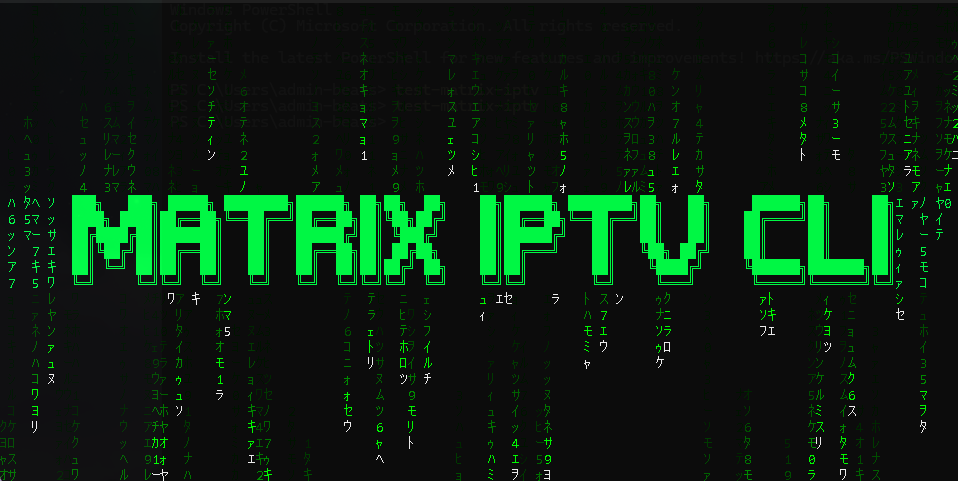
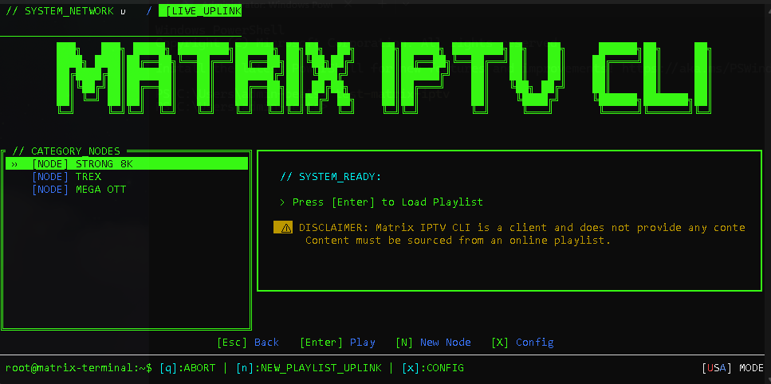
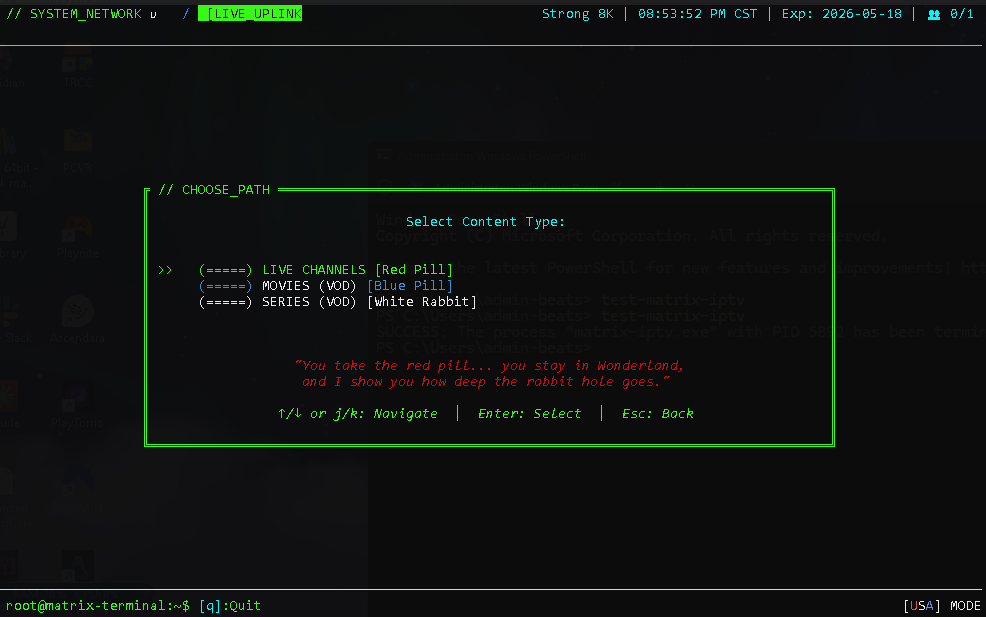
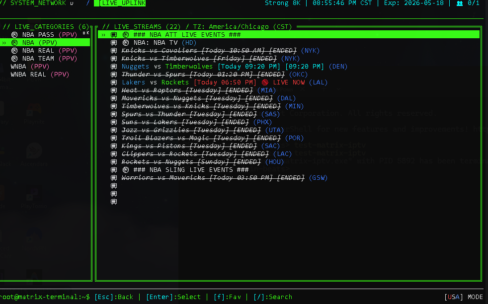

# 🟢 Matrix IPTV CLI



**// THE_PREMIUM_TERMINAL_IPTV_DECODER //**

Matrix IPTV CLI is a blazing fast, keyboard-driven interface for browsing Live TV, Movies, and Series. Inspired by the Matrix and built with Rust, it's designed to be the ultimate premium TUI (Terminal User Interface) for IPTV power users.

This project is being actively optimized by **Ernesto "Beats"** with a primary focus on **Live TV and Sports** performance, ensuring zero-latency navigation and professional-grade video clarity.

---

## 📸 Gallery

<p align="center">
  
  
  <br />
  
</p>

---

## 🚀 Instant Installation

**Prerequisites:** Matrix IPTV CLI requires **MPV Player** (for video) and **Node.js** (for the CLI).

#### **Don't have MPV Player?**

- **Windows:** `winget install info.mpv.mpv`
- **Mac:** `brew install mpv`
- **Linux:** `sudo apt install mpv`

#### **Don't have Node.js?**

- **Windows:** `winget install OpenJS.NodeJS`
- **Mac:** `brew install node`
- **Linux:** `sudo apt install nodejs npm`

### **Global NPM Install (Recommended)**

If you have Node.js installed, this is the easiest way to stay updated:

```bash
npm install -g @officebeats/matrix-iptv-cli
```

### **One-Click Scripts**

Alternatively, use these platform-specific one-liners:

#### **Windows**

```powershell
powershell -ExecutionPolicy Bypass -Command "irm https://raw.githubusercontent.com/officebeats/matrix-iptv/main/install.ps1 | iex"
```

#### **Mac & Linux**

```bash
curl -sSL https://raw.githubusercontent.com/officebeats/matrix-iptv/main/install.sh -o install_matrix.sh && bash install_matrix.sh && rm install_matrix.sh
```

---

## 🎬 How to Run

Simply open any terminal and type:

```bash
matrix-iptv
```

---

## ✨ Features

- **USA Mode**: Strictly optimized for **Strong 8K**, **Mega OTT**, and **TRex**. Hides international clutter and cleans channel names instantly.
- **⚡ Instant Response**: Built in Rust for maximum performance. Navigate tens of thousands of channels with zero lag.
- **📡 Xtream API Native**: Strictly optimized for **Xtream API** providers (support for M3U is not planned at this time).
- **🏟️ Sports & Live Focused**: Layout and performance tuned specifically for the most demanding live events.
- **📁 "All" Content Navigation**: Browse everything at once with "All Channels" and "All Movies" views.
- **🎬 Full Series Support**: Dedicated multi-column view for Series, Seasons, and Episodes.
- **📟 Infinite Screensaver**: High-performance Matrix rain screensaver (find it in Settings).
- **📡 Secure**: Uses Private DNS-over-HTTPS (DoH) for connecting to your provider.
- **📽️ Headless Playback**: Integrated borderless fullscreen mode for a cinematic experience without window distractions.

---

## 🏎️ Optimized Providers

> **⚠️ Disclaimer:** This is an experimental feature strictly targeting the top 3 most widely available playlists on platforms like **z2u** and **g2g**. Please do not request support or additions for other playlists at this time.

> **💻 OS Compatibility:** Development and testing are done primarily on **Windows**. Mac and Linux variants are provided as-is and may contain platform-specific bugs. If you encounter an issue, please report it with **screenshots and a detailed description** so I can "vibe code" a fix. As a Product Manager, I rely on clear visual and descriptive data to troubleshoot!

Matrix IPTV CLI is refined for high-density, high-quality playlists, including:

- **Strong 8K**: Custom filtering logic to remove international clutter (AR|, etc.) and maximize US sports visibility.
- **Mega OTT**: Optimized category parsing and rapid metadata loading.
- **TRex IPTV**: Enhanced sport category prioritization and fast channel tuning.

---

## USA Mode

The **USA Mode** is a powerful filtering and cleaning engine strictly optimized for **Strong 8K**, **Mega OTT**, and **TRex IPTV** playlists.

#### **How to use:**

1. Press the **`x`** key to open **Settings**.
2. Navigate to **USA Mode**.
3. Press **`Enter`** to toggle it On/Off.
4. Press **`Esc`** to return and apply the filtering instantly.

- **Strict Geo-Filtering**: Automatically hides international categories (UK, AR, etc.) in these optimized playlists to keep your list clean.
- **Clean Channel Names**: Removes redundant tags like `US |`, `USA |`, and `FHD |` from channel names, leaving you with just the name of the network.
- **Smart Filtering**: Prioritizes American sports and local networks (NFL, NBA, ESPN) for an effortless viewing experience.

---

## 📽️ MPV Enhancements

We leverage advanced **MPV** flags to ensure professional-level video quality even on lower-end hardware:

- **Headless Fullscreen**: Launches directly into borderless fullscreen (`--no-border`, `--fs`) for a professional, TV-like experience.
- **Advanced Anti-Aliasing**: Uses `spline36` scaling, providing superior edge smoothing and diagonal line clarity on any machine.
- **Oversample Upscaling**: High-quality temporal upscaling that sharpens images while reducing movement flickering (Temporal AA).
- **Motion Smoothing**: High-performance `display-resample` interpolation for fluid sports playback at native refresh rates.
- **Hardware Acceleration**: Automatic `hwdec=auto-safe` with modern Windows `d3d11-flip` presentation for zero-copy GPU decoding.
- **Anti-Ringing Filter**: Eliminates halos around sharp edges and logos for a cleaner, high-end look.

---

## ⌨️ Common Controls

| Key                     | Action                                                     |
| :---------------------- | :--------------------------------------------------------- |
| **`Enter`**             | **Play Channel / Select Category**                         |
| **`Esc` / `Backspace`** | **Go Back**                                                |
| **`f`**                 | **Favorite** (Add/Remove current item from Favorites)      |
| **`/`**                 | **Search** (Filters results instantly)                     |
| **`j` / `↓`**           | Move Down                                                  |
| **`k` / `↑`**           | Move Up                                                    |
| **`x`**                 | **Settings** (Update your playlist or turn on Screensaver) |
| **`q`**                 | **Quit**                                                   |

---

## 🛠️ Prerequisites

The installation scripts will attempt to install these for you:

- **MPV Player**: [mpv.io](https://mpv.io)
- **Rust Compiler**: [rustup.rs](https://rustup.rs) (Only required for manual builds)

---

<details>
<summary><strong>🛒 Where to Buy Playlists (Click to Expand)</strong></summary>

<br>

The experimental "USA Mode" is optimized for **Strong 8K**, **TRex**, and **Mega OTT** playlists. These are typically sourced from third-party marketplaces:

- **Platforms**: **z2u.com** or **g2g.com**
- **Search Terms**: "Strong 8k IPTV", "Trex IPTV", "Mega OTT"
- **Duration**: Usually sold in **1-month**, **6-month**, or **1-year** increments.

### ✅ Buying Tips

1.  **Check Ratings**: Always choose a seller with a **high rating (98%+)** and a high sales count. These are 2-sided marketplaces, so reputation is everything.
2.  **Safe Payment**: Use strictly secure payment methods like **Google Pay** or **Apple Pay** directly through your device. Avoid direct bank transfers or obscure payment links.

> **⚠️ Disclaimer:** Matrix IPTV CLI and its creator, are **not affiliated** with z2u, g2g, or any IPTV provider. We do not sell or distribute content. All transactions on these platforms are at your own risk. This guide is for informational purposes only (experimental "USA Mode" testing).

</details>

---

## ⚡ Community & Support

Built and optimized with ❤️ by **Ernesto "Beats"** with the help of google antigravity and vibe coding during his PTO vacation time.

[](https://x.com/officebeats)
[](https://discord.com/users/317887730703138826)

---

## 📜 License

MIT // [ProductMG.com](https://www.productmg.com)
