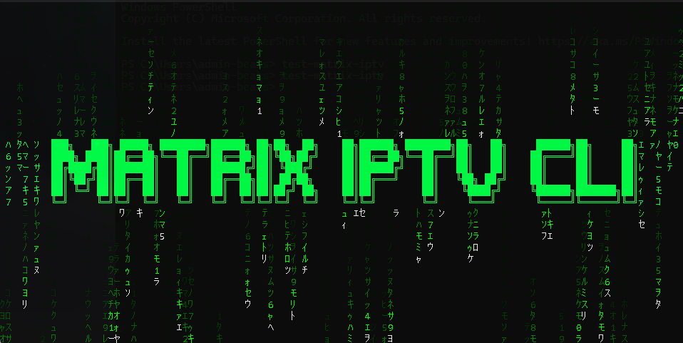
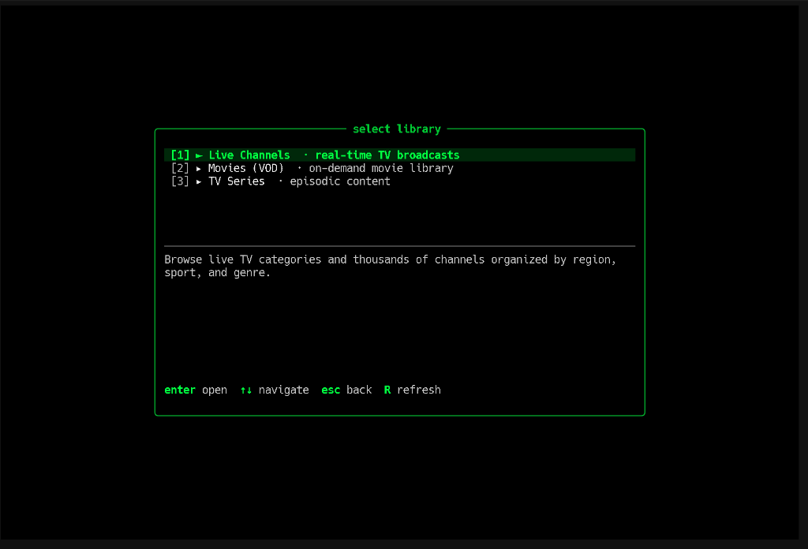
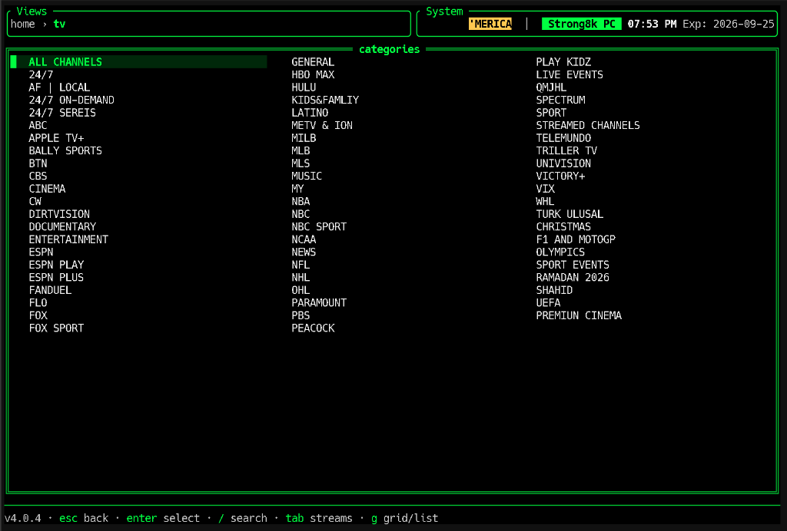
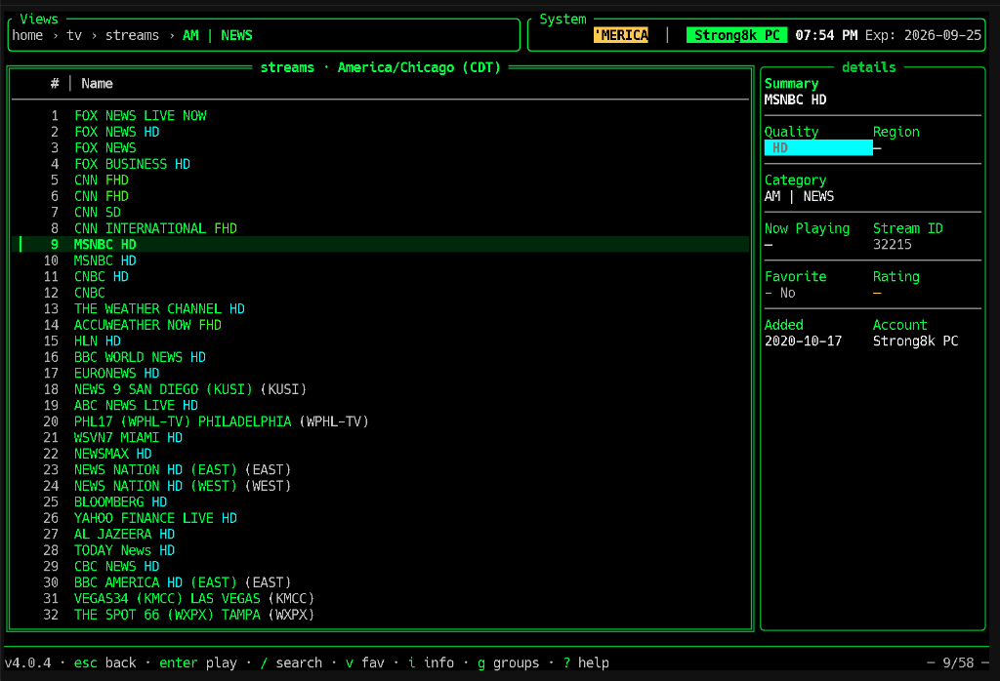
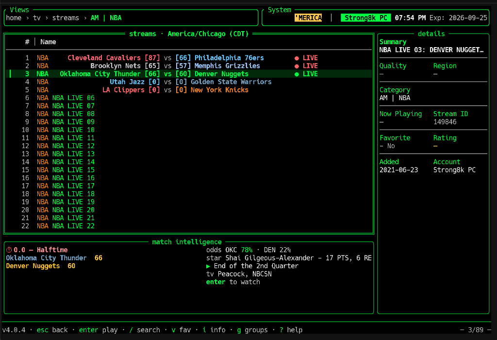
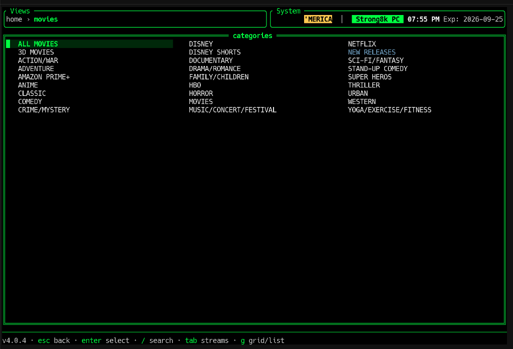
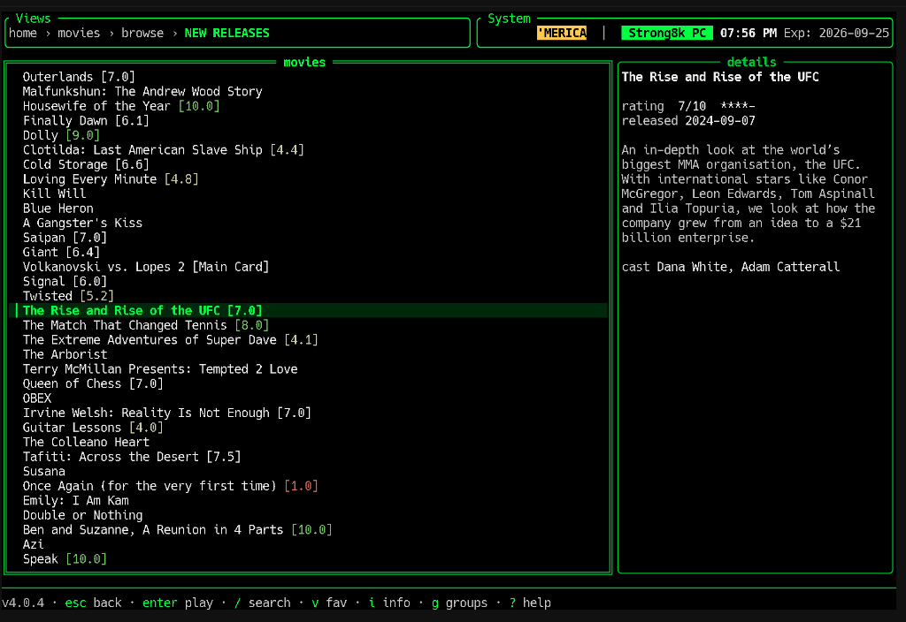

# 🟢 Matrix IPTV CLI



**// THE_PREMIUM_TERMINAL_IPTV_DECODER //**

Matrix IPTV CLI is a blazing fast, keyboard-driven interface for browsing Live TV, Movies, and Series. Inspired by the Matrix and built with Rust, it's designed to be the ultimate premium TUI (Terminal User Interface) for IPTV power users.

This project is being actively optimized by **Ernesto "Beats"** with a primary focus on **Live TV and Sports** performance, ensuring zero-latency navigation and professional-grade video clarity.

---

## 📸 Gallery

<p align="center">
  
  
  <br />
  
  
  <br />
  
  
  <br />
  
</p>

---

## 🚀 Instant Installation

**Prerequisites:** Matrix IPTV CLI requires **MPV Player** (for video) and **Node.js** (for the CLI).

#### **Don't have MPV Player?**

- **Windows:** `winget install mpv`
- **Mac:** `brew install mpv`
- **Linux:** `sudo apt install mpv`

#### **Don't have Node.js?**

- **Windows:** `winget install OpenJS.NodeJS`
- **Mac:** `brew install node`
- **Linux:** `sudo apt install nodejs npm`

### **Instant NPX Run (Recommended)**

If you have Node.js installed, the fastest install-and-run command is:

```bash
npx matrix-iptv
```

### **Global NPM Install**

If you have Node.js installed, this is the easiest way to stay updated:

```bash
npm install -g matrix-iptv
```

Legacy package name still works:

```bash
npm install -g @officebeats/matrix-iptv-cli
```

<details>
<summary><strong>🚀 One-Click Install Scripts (Click to Expand)</strong></summary>

#### **Windows**

```powershell
powershell -ExecutionPolicy Bypass -Command "irm https://raw.githubusercontent.com/officebeats/matrix-iptv/main/install.ps1 | iex"
```

#### **Mac & Linux**

```bash
curl -sSL https://raw.githubusercontent.com/officebeats/matrix-iptv/main/install.sh -o install_matrix.sh && bash install_matrix.sh && rm install_matrix.sh
```

</details>

---

## 🎬 How to Run

The app will **auto-launch** instantly after installation! 🚀

For future sessions, simply open any terminal and type:

```bash
matrix-iptv
```

---

## ✨ Features

- **🛡️ Multi-Select Playlist Modes**: Combine optimizations like **'Merica**, **Sports**, and **All-English** in real-time.
- **⚡ Instant Response**: Built in Rust for maximum performance. Navigate tens of thousands of channels with zero lag.
- **📡 Xtream API Native**: Strictly optimized for **Xtream API** providers (support for M3U is not planned at this time).
- **🔎 Global Search**: Press **`Ctrl`+`Space`** (displayed as `🔎🌐 Ctrl+Space`) to search across Live TV, Movies, and Series content instantly. Results are limited to 100 items total (channels, movies, and series combined).
- **📁 Unified Navigation**: "All" views for Channels, Movies, and Series allow for rapid browsing without digging into categories. Use **Tab** to switch between categories and streams, **Left/Right** arrows to navigate panes. Use **Tab** to switch between categories and streams, **Left/Right** arrows to navigate panes.
- **🎨 Color-Coded UX**: Rebuilt footer with screen-aware hints and color coding.
- **🚥 Mode Indicators**: Colorful header indicators (Red/White/Blue for 'Merica, Yellow for Sports, Blue for All-English).
- **📋 Paste Support**: Support for `Ctrl+V` in login fields for quick credentials setup.
- **🎬 Full Series Support**: Dedicated browsing for TV Shows with Season/Episode hierarchy and tracking.
- **🎞️ VOD Experience**: Browse movies with rich metadata and instant playback.
- **📟 Matrix Rain Screensaver**: A high-performance, authentic digital rain screensaver that activates when idle.
- **🔒 Secure**: Uses Private DNS-over-HTTPS (DoH) for secure provider connection.
- **⚡ Jump Navigation**: Press **`g`** to jump to bottom, **`G`** to jump to top, or **`0`-`9`** to jump directly to items 0-9 in any list.
- **⚡ Jump Navigation**: Press **`g`** to jump to bottom, **`G`** to jump to top, or **`0`-`9`** to jump directly to items 0-9 in any list.

## 🛡️ Playlist Modes

Matrix IPTV CLI features advanced preprocessing engines called **Playlist Modes**. These filters run _before_ content reaches your screen to optimize the experience.

#### **Multi-Selectable Modes**

You can now toggle multiple modes simultaneously!

- **'Merica Mode 🇺🇸**: Geo-filters for English content and renames "American Football" to "Football".
- **Sports Mode 🏟️**: Hoists sports categories and adds icons (🏀 NBA, 🏈 NFL, etc.).
- **All-English 🇬🇧**: strictly filters for English, UK, and CA content, hiding all international categories.

To change modes:

1. Press **`m`** (Universal Mode Toggle).
2. Use **`Space`** or **`Enter`** to toggle checkboxes for each mode.
3. Select **`APPLY & SAVE`** to rebuild your playlist matrix.

---

## 📽️ MPV Enhancements

We leverage advanced **MPV** flags to ensure professional-level video quality even on lower-end hardware:

- **Fullscreen Mode**: Launches directly into fullscreen (`--fs`) for a professional, TV-like experience.
- **On Screen Controller**: Enables `--osc=yes` for usability and control.
- **Advanced Anti-Aliasing**: Uses `spline36` scaling, providing superior edge smoothing.
- **Oversample Upscaling**: High-quality temporal upscaling that sharpens images.
- **Motion Smoothing**: High-performance `display-resample` interpolation for fluid sports playback.
- **Hardware Acceleration**: Automatic `hwdec=auto-safe` with modern Windows `d3d11-flip` presentation.

---

## ⚙️ Advanced Features

Matrix IPTV CLI provides several core utilities to manage complex setups safely:

- **VLC Fallback Integration**: While MPV provides the ultimate playback tier, you can configure the app to fall back to launching VLC Media Player instead, maximizing compatibility.
- **Dynamic Background Sync**: Automatically handles large playlist parsing without hanging the UI, providing fluid progress updates and ETAs while it indexes tens of thousands of channels.

---

## ⌨️ Common Controls

| Key                     | Action                                        |
| :---------------------- | :-------------------------------------------- |
| **`Enter`**             | **Play Channel / Select / Confirm**           |
| **`Esc` / `Backspace`** | **Go Back / Cancel**                          |
| **`Ctrl` + `Space`**    | **Global Search** (Search everything)         |
| **`f`** or **`/`**      | **Local Search** (Filter current view)        |
| **`v`**                 | **Toggle Favorite**                           |
| **`j` / `↓`**           | Move Down                                     |
| **`k` / `↑`**           | Move Up                                       |
| **`g`**                 | **Toggle Grid View / Group Menu**             |
| **`G`**                 | **Manage Groups / Jump to Bottom (VOD)**      |
| **`0`-`9`**             | **Jump to Item / Switch Account (Home)**      |
| **`m`**                 | **Settings: Playlist Mode**                   |
| **`x`**                 | **Settings**                                  |
| **`n`**                 | **New Playlist** (Home Screen)                |
| **`e`**                 | **Edit Playlist** (Home Screen)               |
| **`d`**                 | **Delete Playlist** (Home Screen)             |
| **`r`**                 | **Refresh Playlist** (Global)                 |
| **`q`**                 | **Quit**                                      |

---

## 🛠️ Prerequisites

The installation scripts will attempt to install these for you:

- **MPV Player**: [mpv.io](https://mpv.io)
- **Rust Compiler**: [rustup.rs](https://rustup.rs) (Only required for manual builds)

---

> **⚠️ Disclaimer:** Matrix IPTV CLI and its creator, are **not affiliated** with z2u, g2g, or any IPTV provider. We do not sell or distribute content. All transactions on these platforms are at your own risk. This guide is for informational purposes only (experimental "USA Mode" testing).

<details>
<summary><strong>🛒 Where to Buy Playlists (Click to Expand)</strong></summary>

<br>

The experimental "USA Mode" is optimized for **Strong 8K**, **TRex**, and **Mega OTT** playlists. These are typically sourced from third-party marketplaces:

- **Platforms**: **z2u.com** or **g2g.com**
- **Search Terms**: "Strong 8k IPTV", "Trex IPTV", "Mega OTT"
- **Duration**: Usually sold in **1-month**, **6-month**, or **1-year** increments.

### ✅ Buying Tips

1.  **Check Ratings**: Always choose a seller with a **high rating (98%+)** and a high sales count. These are 2-sided marketplaces, so reputation is everything.
2.  **Safe Payment**: Use strictly secure payment methods like **Google Pay** or **Apple Pay** directly through your device. Avoid direct bank transfers or obscure payment links.

</details>

---

## ⚡ Community & Support

Built and optimized with ❤️ by **Ernesto "Beats"** with the help of google antigravity and vibe coding during his PTO vacation time.

[](https://x.com/officebeats)
[](https://discord.com/users/317887730703138826)

---

## 📜 License

MIT // [ProductMG.com](https://www.productmg.com)
